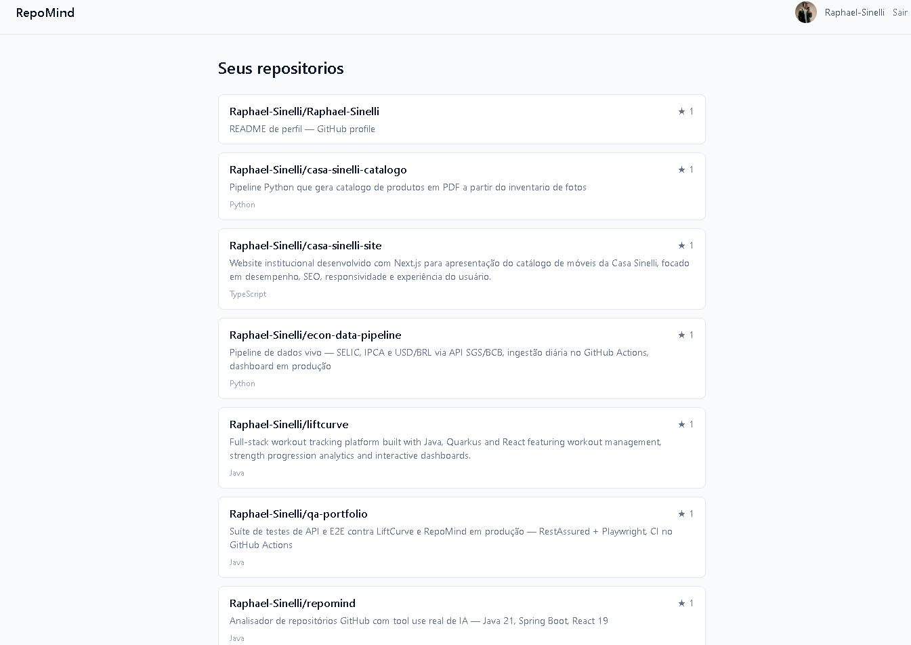
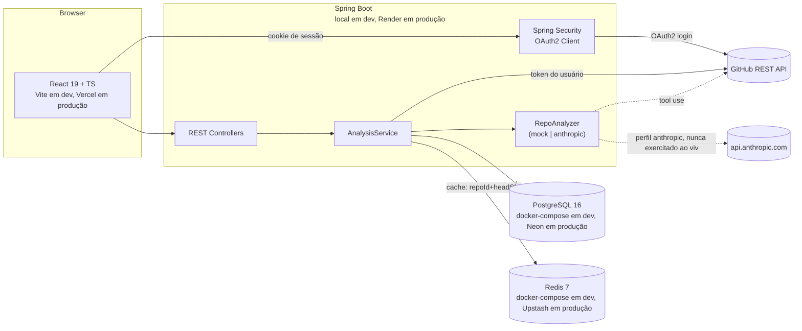

# RepoMind

Analisador de repositórios GitHub com **tool use real de IA**: o modelo decide
quais ferramentas chamar (commits, README, issues) e o backend as executa. Não é
um prompt único — é um loop de agente, com o modelo decidindo em cada rodada se
quer mais dados ou se já pode responder.

Projeto de portfólio. Java 21 + Spring Boot no backend, React 19 no frontend.


*Lista de repositórios após autenticação via GitHub OAuth*

## Demo

**[repomind-flame.vercel.app](https://repomind-flame.vercel.app)** — deploy real,
login OAuth real, fluxo completo funcionando.

> **Primeira requisição pode levar ~30-50s.** O backend roda no tier gratuito do
> Render, que hiberna sem tráfego — é normal, não é bug. Depois do primeiro
> load, tudo fica rápido.

O login usa OAuth de verdade contra a API do GitHub — **não existe usuário de
demonstração**. Cada pessoa que autoriza o app vê os próprios repositórios dela,
não os do autor do projeto. Isso é o comportamento esperado, não um bug: é a
prova de que a integração OAuth e o `GitHubClient` são reais, não mockados. Pra
testar de verdade é preciso autorizar com a própria conta GitHub (permissões
`read:user`, `user:email`, `repo` — leitura, nunca escrita).

## Stack

| Camada | Tecnologia |
|---|---|
| Backend | Java 21, Spring Boot 3.5, Spring Security (OAuth2 Client), Spring Data JPA, PostgreSQL, Flyway, Spring Data Redis |
| IA | `com.anthropic:anthropic-java`, loop manual de tool use, structured outputs |
| Frontend | React 19, TypeScript, Vite, Tailwind CSS v4, TanStack Query, React Router, Axios |
| Infra | Docker (dev + Dockerfile de produção), GitHub Actions CI |
| Testes | JUnit 5, Testcontainers (Postgres + Redis), MockWebServer, Vitest, Testing Library |

## Arquitetura



### Fluxo de uma análise

```
POST /api/v1/repositories/{id}/analyses
  → GitHubClient.getHeadCommitSha()
  → Redis GET analysis:{repoId}:{sha}   — HIT? retorna, zero custo de IA
  → MISS: RepoAnalyzer.analyze()
        loop manual: enquanto stop_reason == "tool_use"
          executa a tool pedida (get_commits | get_readme | get_issues)
          devolve o resultado ao modelo numa única mensagem
        até resposta final (JSON validado via structured output)
  → persiste em Postgres, grava no Redis (TTL 24h), retorna ao cliente
```

A chave de cache é `repoId + SHA do HEAD`, não um TTL simples: TTL sozinho
serviria uma análise obsoleta depois de um push. Amarrar ao commit invalida
exatamente quando o repositório muda.

## Deploy

A produção pública roda numa stack gratuita, escolhida por custo — não é a
arquitetura "de produção real" deste projeto (essa é a AWS, ver
[`infra/`](infra/README.md) abaixo):

| Componente | Onde | Nota |
|---|---|---|
| Frontend | Vercel | `vercel.json` reescreve `/api/*`, `/oauth2/*` e o callback do GitHub para o backend no Render (Vercel não tem o proxy do Vite), mais um catch-all pra `/index.html` (sem ele, rotas do React Router acessadas direto pela URL davam 404) |
| Backend | Render (Docker, tier gratuito) | `backend/Dockerfile` multi-stage; lê `PORT` injetada pelo Render em runtime, sem alterar `application.yml` |
| Postgres | Neon | TLS obrigatório — `POSTGRES_SSL_MODE=require` |
| Redis | Upstash | TLS + senha obrigatórios — `REDIS_SSL=true`, `REDIS_PASSWORD` |

Todas as variáveis novas de TLS/senha (`POSTGRES_SSL_MODE`, `REDIS_PASSWORD`,
`REDIS_SSL`) têm default seguro para o dev local (`disable`, vazio, `false`) — o
`docker-compose.yml` local nunca fala TLS e continua funcionando sem mudança.

O design de produção "real" deste projeto é AWS (VPC, RDS, ElastiCache, ECS
Fargate, ALB, Secrets Manager), versionado em Terraform em
[`infra/`](infra/README.md) mas **nunca aplicado** — custo contínuo sem
orçamento alocado pra um projeto de portfólio.

## Escopo da integração com IA

O `AnthropicAnalyzer` (perfil `anthropic`) implementa o loop de tool use por
completo e é coberto por testes com `MockWebServer` simulando o protocolo da API
(tool_use → tool_result, replay de blocos de thinking, teto de iterações, erro
de tool virando `tool_result` com `is_error`). **Ele nunca foi executado contra
`api.anthropic.com`** — este projeto não tem uma chave da Anthropic.

O perfil padrão (`mock`, ativo também em produção) usa o `MockAnalyzer`: busca
dados reais do GitHub (README, commits, issues) e deriva uma nota por
heurística local, sem chamar nenhum modelo. Tudo o mais no fluxo — OAuth,
Postgres, Redis, cache por commit SHA, frontend — é real.

Trocar para a integração real é uma variável de ambiente
(`SPRING_PROFILES_ACTIVE=anthropic` + `ANTHROPIC_API_KEY`), não uma reescrita —
mas até isso acontecer, a afirmação honesta é "o loop está correto conforme a
especificação da API e testado no nível de protocolo", não "funciona em
produção".

## Achados reais

Não ficaram só no código — apareceram rodando o sistema de verdade (Testcontainers,
navegador, deploy real). Registro porque cada um ensina algo específico.

| Bug | Causa raiz | Como foi descoberto | Fix |
|---|---|---|---|
| `POST` de análise sempre 403 | Backend usa `CookieCsrfTokenRepository` (Spring Security); Axios não envia o cookie `XSRF-TOKEN` como header `X-XSRF-TOKEN` por padrão. A rejeição acontece no filtro de segurança, antes do controller — a resposta não vem no formato `{error:{...}}`, então o frontend só tinha um erro genérico pra mostrar | Testando o fluxo de análise de ponta a ponta no navegador (não pego por teste automatizado) | `withXSRFToken`, `xsrfCookieName`, `xsrfHeaderName` explícitos no client Axios |
| Teste de igualdade de `User` falhava só contra Postgres real | `Instant.now()` tem precisão de nanossegundos; `TIMESTAMPTZ` do Postgres trunca pra microssegundos. Reler a entidade do banco devolvia um timestamp diferente do que foi criado em memória | Testcontainers (Postgres real, não H2) — um banco em memória com semântica diferente teria escondido isso | `Instant.now().truncatedTo(ChronoUnit.MICROS)` na entidade |
| Parâmetros de tool sempre viravam o valor default, sem erro em lugar nenhum | `JsonValue.toString()` no SDK da Anthropic produz formato Java-map (`{limit=42}`), não JSON — parsear isso como JSON falhava silenciosamente e o código caía no fallback | Teste verificando o argumento chegando ao `GitHubToolExecutor` | Trocado para `JsonValue.convert(Map.class)` |
| CORS derrubava a config de segurança no boot em produção | `${FRONTEND_ORIGIN:http://localhost:5173}` só aplica o default quando a variável **não existe**. No Render ela estava setada como string vazia (não omitida), e chegava vazia pro Spring | Deploy real no Render | Garantir que a env var simplesmente não seja definida quando se quer o default, em vez de definida como vazia |
| CI falhava em 6s com "Permission denied" no `./mvnw` | Commit original feito no Windows: `git-bash` mostra `rwxr-xr-x` no `ls` local, mas isso é só ACL do Windows sendo simulada — o modo real gravado no objeto git era `100644` (não executável). Runner Linux do Actions respeita o modo real | `gh run view --log-failed` no job que falhava | `git update-index --chmod=+x backend/mvnw` |
| CI nunca disparou em nenhum push, sem nenhum erro visível | `ci.yml` filtrava `branches: [main]`, mas o repositório usa `master` como branch padrão | Auditoria manual — `gh api .../actions/runs` retornava `total_count: 0` | Branch filter corrigido pra `master` |
| Rotas do React Router acessadas direto pela URL davam 404 no Vercel | Sem rewrite catch-all, o Vercel tentava servir `/repositories` como arquivo estático em vez de deixar o React Router resolver client-side | Acessando a URL direto em produção | Rewrite `/(.*) → /index.html` adicionado por último em `vercel.json`, depois dos rewrites de API/OAuth |

## Como executar

```bash
git clone <repo>
cd repomind
cp .env.example .env   # preencha GITHUB_CLIENT_ID/SECRET do seu OAuth App
docker compose up -d   # Postgres + Redis

cd backend
JAVA_HOME=<jdk21> ./mvnw spring-boot:run   # :8080, perfil "mock" por padrão

cd ../frontend
npm ci
npm run dev             # :5173, proxy /api e /oauth2 para :8080
```

GitHub OAuth App: callback URL deve ser `http://localhost:8080/login/oauth2/code/github`.

Fluxo manual: abrir `localhost:5173` → "Entrar com GitHub" → autorizar → lista de
repositórios reais → clicar "Analisar" → resumo + nota + sugestões → clicar de
novo → resposta instantânea (cache hit, confirmável em `docker compose logs`).

```bash
cd backend && ./mvnw verify     # 41 testes: unit + integração com Testcontainers
cd frontend && npm test         # Vitest + Testing Library
```

## API

Erros sempre no formato `{"error":{"code","message","status"}}`.

| Método | Rota | Descrição |
|---|---|---|
| `GET` | `/oauth2/authorization/github` | Inicia login |
| `GET` | `/api/v1/me` | Usuário logado (401 se anônimo) |
| `POST` | `/api/v1/logout` | Encerra sessão |
| `GET` | `/api/v1/repositories` | Lista + sincroniza repos do usuário |
| `POST` | `/api/v1/repositories/{id}/analyses` | Dispara análise (cache-aware) |
| `GET` | `/api/v1/repositories/{id}/analyses` | Histórico, mais recente primeiro |

## Infraestrutura AWS

Design de produção completo (VPC, RDS, ElastiCache, ECR, ECS Fargate, ALB,
Secrets Manager) versionado em Terraform, nunca aplicado. Diagrama e detalhes em
[`infra/README.md`](infra/README.md).

## Licença

Este projeto está sob a licença MIT — ver [LICENSE](LICENSE).

## Autor

Raphael Sinelli

Tecnólogo em Análise e Desenvolvimento de Sistemas — FIAP

- GitHub: https://github.com/Raphael-Sinelli
- LinkedIn: https://www.linkedin.com/in/raphael-sinelli/
- E-mail: raphaelsinelli@gmail.com
