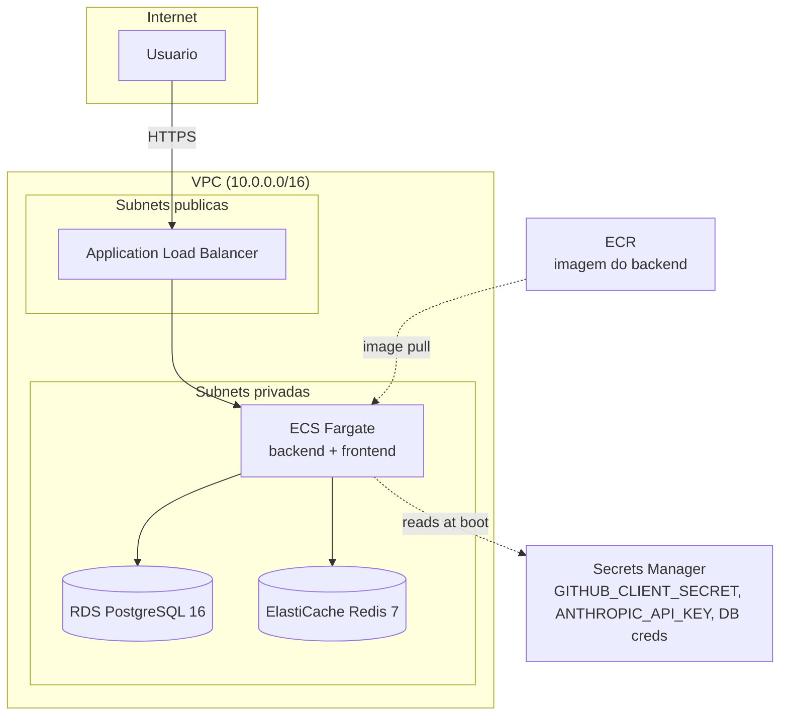

# RepoMind — Infraestrutura AWS (Terraform)

**Este diretorio e versionado como design de infraestrutura. Nunca foi executado
(`terraform apply`) contra uma conta AWS real.** E a demonstracao de como o projeto
seria implantado, nao um ambiente provisionado.

## Arquitetura



## Componentes

| Recurso | Modulo/arquivo | Proposito |
|---|---|---|
| VPC + subnets pub/priv | `vpc.tf` | Isola RDS/ElastiCache/ECS da internet direta |
| RDS PostgreSQL 16 | `rds.tf` | Substitui o `postgres:16-alpine` do Docker Compose local |
| ElastiCache Redis 7 | `elasticache.tf` | Substitui o `redis:7-alpine` local |
| ECR | `ecr.tf` | Registro da imagem do backend (`backend/Dockerfile`) |
| ECS Fargate + task def | `ecs.tf` | Roda o backend sem gerenciar servidores |
| ALB | `alb.tf` | TLS termination, roteia `/api`, `/oauth2` ao ECS |
| Secrets Manager | `secrets.tf` | `GITHUB_CLIENT_SECRET`, `ANTHROPIC_API_KEY`, credenciais do RDS — nunca em variavel de ambiente em texto plano no task definition |

## Por que nao foi aplicado

Este e um projeto de portfolio sem orcamento de AWS alocado. Provisionar RDS +
ElastiCache + ALB gera custo continuo (nao ha tier gratuito para RDS Multi-AZ nem
para ElastiCache). O Terraform fica pronto para `terraform plan`/`apply` no dia em
que houver uma conta AWS dedicada — o objetivo aqui e demonstrar a modelagem da
infra, nao manter recursos ociosos rodando.

## Se fosse aplicar

```bash
cd infra
terraform init
terraform plan -var-file=prod.tfvars   # prod.tfvars nao versionado — contem account id, etc.
terraform apply
```

Frontend nao esta no ECS: seria estatico, publicado em S3 + CloudFront (fora do
escopo deste `infra/` porque o foco da demonstracao e o backend com estado).
